# git-branch-and-merging
simulation of git branching and merging

## Below are the screenshot of the steps.

- Step 16 
Tom changing branch to "update-navigation" branch on Remote repository Github, screenshot below:

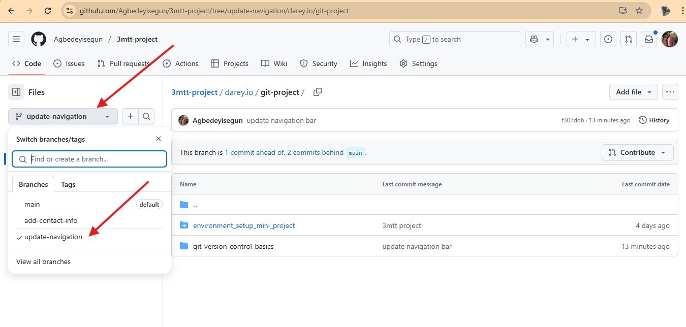

- Step 17 
Tom creating Pull Request on the remote repository Github  "update-navigation" branch, screenshot below:

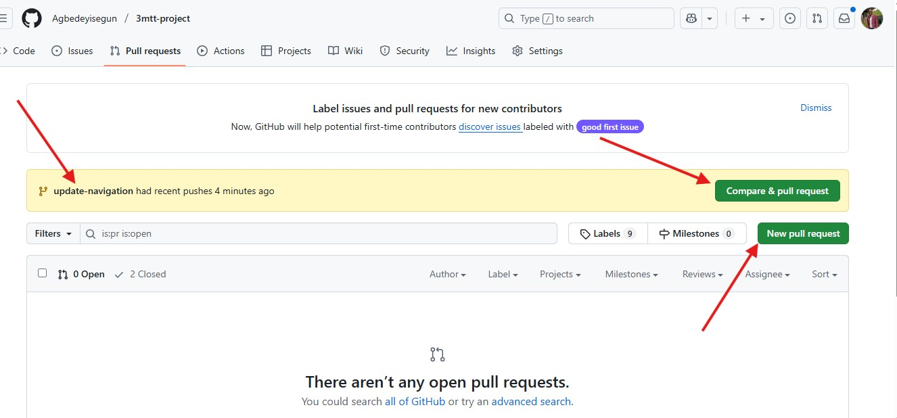

- Step 18a 
Tom to create Pull Request on the remote repository Github  "update-navigation" branch, screenshot below:

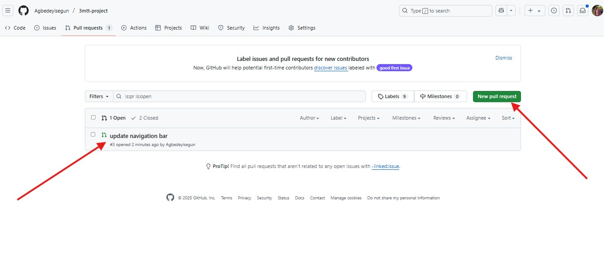

- Step 18b 
Opening a Pull Request of "update-navigation" branch on the remote repository Github. screenshot below:

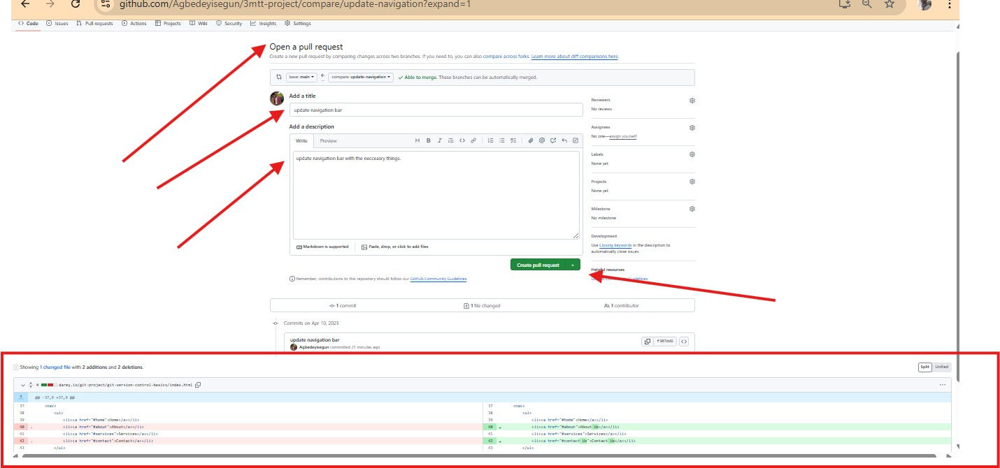

- Step 19 
Comparing changes on "update-navigation" branch and the "main" branch. screenshot below:

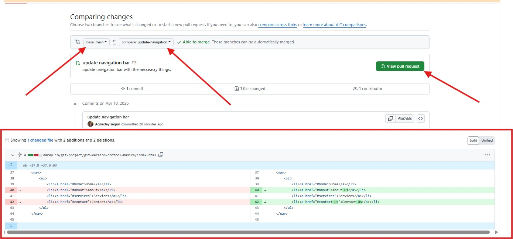

- Step 20a 
Reviewing and making neccessary suggestion on "update-navigation" branch before merging to the "main" branch. screenshot below:

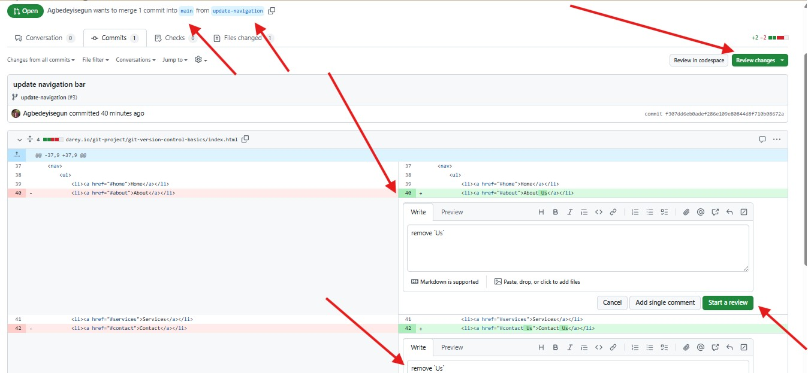

- Step 20b 
merging of "update-navigation" branch with the "main" branch. screenshot below:

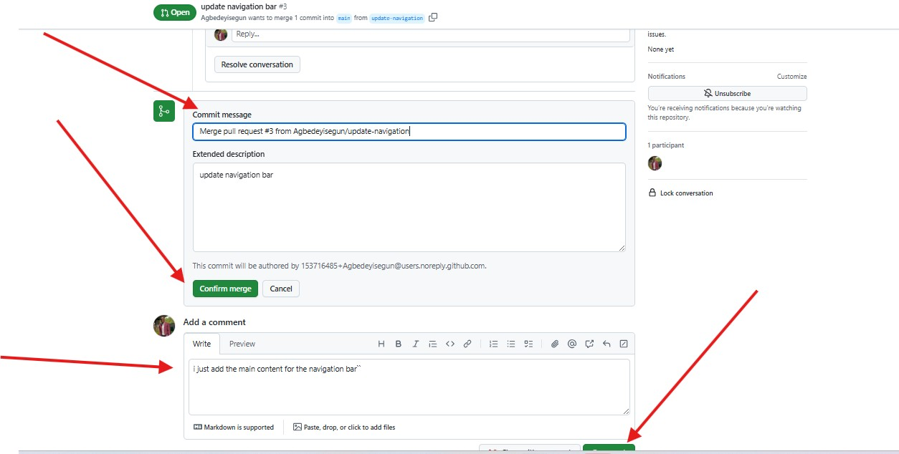

- Step 21 
Successful merging of "update-navigation" branch with the "main" branch. screenshot below:

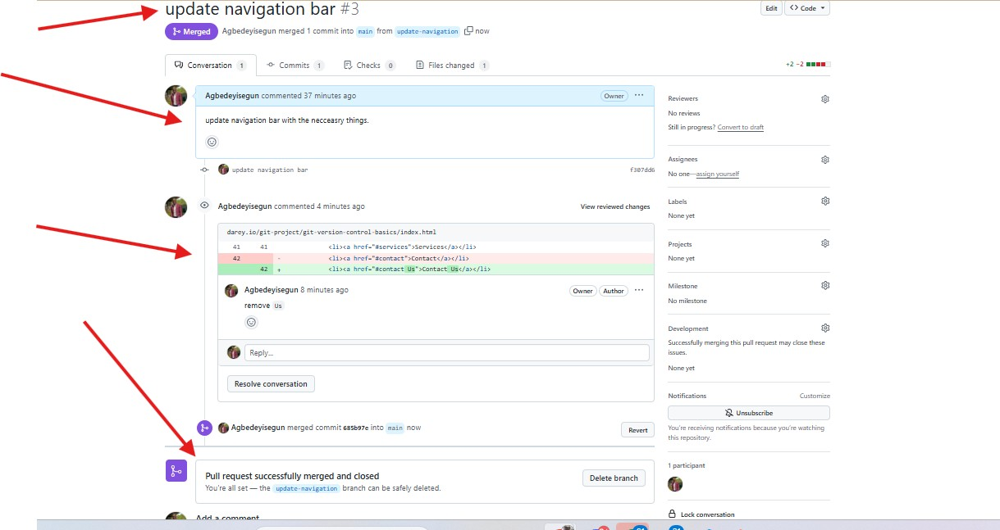

- Step 22 
pull all the changes from the "main" branch to "add-contact-info" branch before creating a new pull request from the branch with cmd `git pull origin main` on vim text editor. screenshot below:

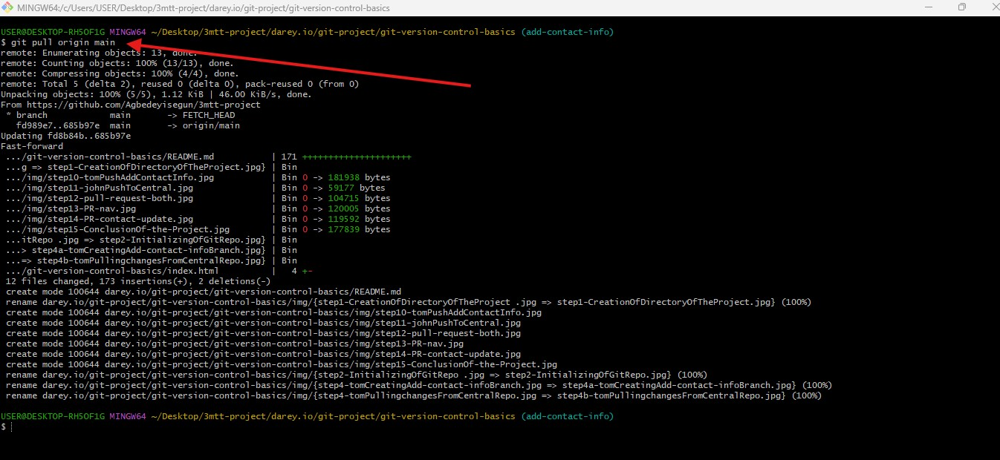

- Step 22b 
pull all the changes from the "main" branch to "add-contact-info" branch before creating a new pull request from the branch with cmd `vim index.html`, `git add .`, `git commit -m "add-contact-information"` and `git push origin add-contact-info`.Screenshot below:

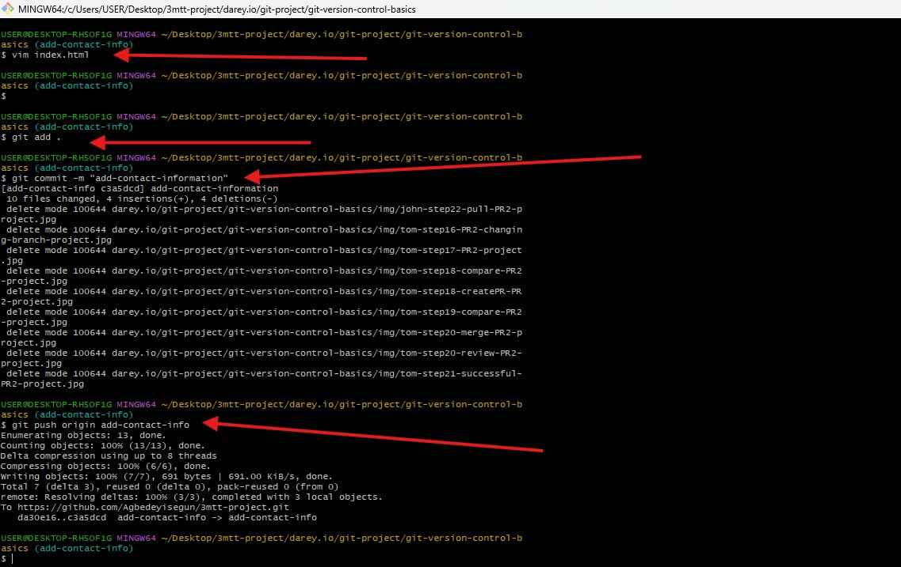

- Step 23 
John about to create PR on the "main" branch. Screenshot below:

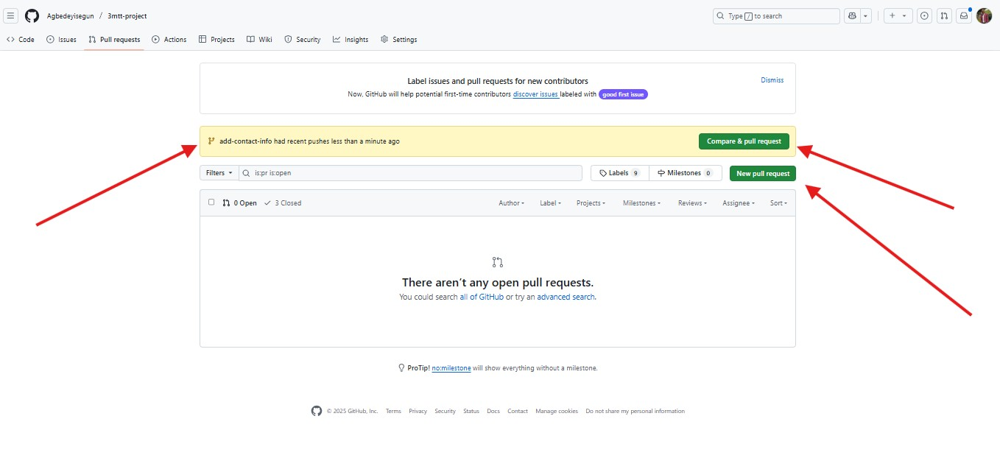

- Step 24 
John open PR on the "main" branch. Screenshot below:

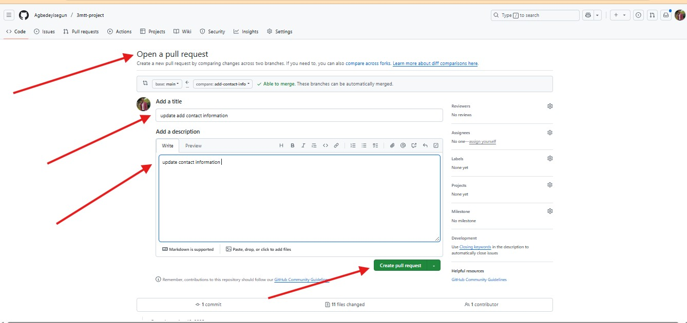

- Step 25 
Trying to merge PR on the "main" branch. Screenshot below:

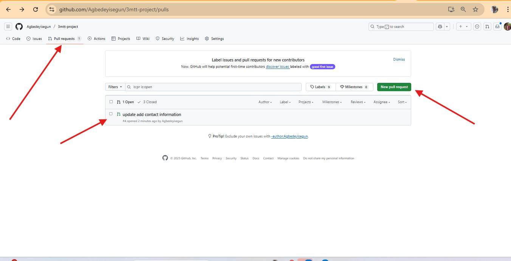

- Step 26 
Successfully merging PR on the "main" branch from the "add-contact-info" branch. Screenshot below:

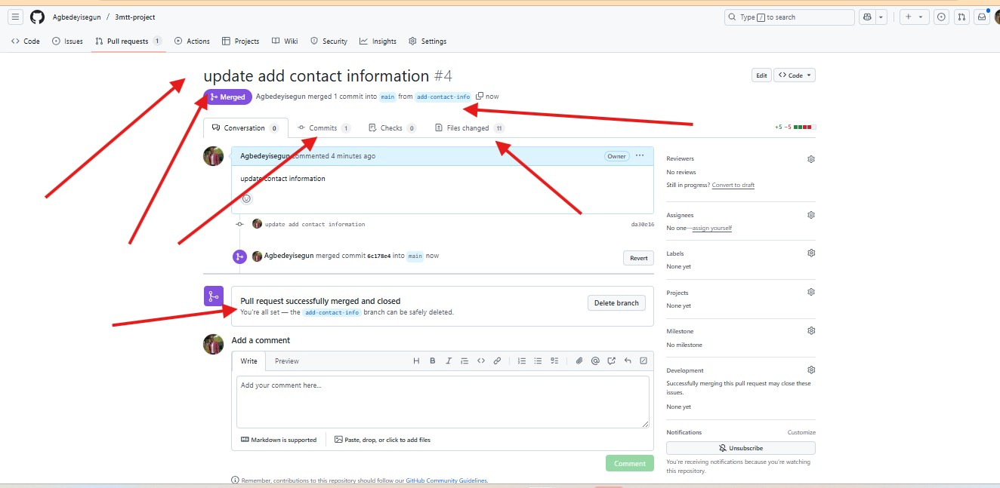

- Step 27
Evidence to show that all the PR is close and no comflict on all the branches. Screenshot below:

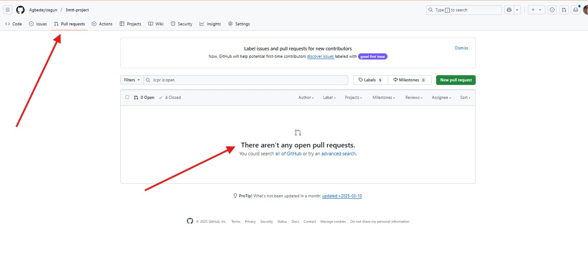